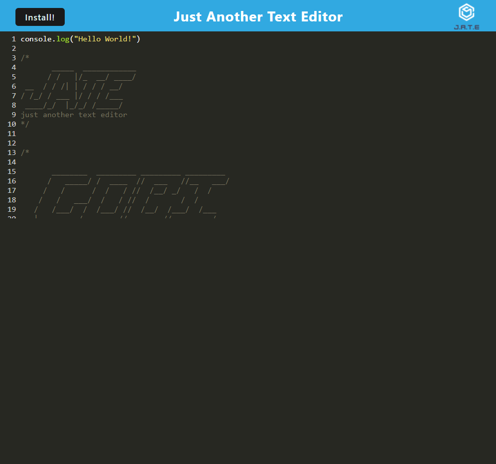

# Text-Editor

## <section id = "License">License</section>
N/A

## <section id = "Description">Description</section>

This text editor is a progressive web application that was made made using html-webpack-plugin/ webpack-pwa-manifest and users of the application can install it as an icon onto their desktop. The content entered into the text editor will be saved with IndexedDB and can be retrieved next time the user opens the application.

Link to deployed application: https://text-editor-v1.herokuapp.com/

## Table of Contents
1.) <a href = "#License">License</a> 
2.) <a href = "#Description">Description</a> 
3.) <a href = "#Installation">Installation</a>  
4.) <a href = "#Usage">Usage</a> 
5.) <a href = "#Contributing">Contributing</a> 
6.) <a href = "#Tests">Tests</a> 
7.) <a href = "#Questions">Questions</a>

## <section id = "Installation">Installation</section>
Command to Install Dependencies: npm i

## <section id = "Usage">Usage</section>
Using the Repo: npm run start

## <section id = "Contributing">Contributing</section>
Contributing to the Repo: Currently not taking contributions.

## <section id = "Tests">Tests</section>
Command to Run Tests: N/A

## <section id = "Questions">Questions</section>
If you have any questions, please feel free to contact me:   
1.) Github Username: Cgotts1  
2.) Email Address: cobi.gottschalk@gmail.com
